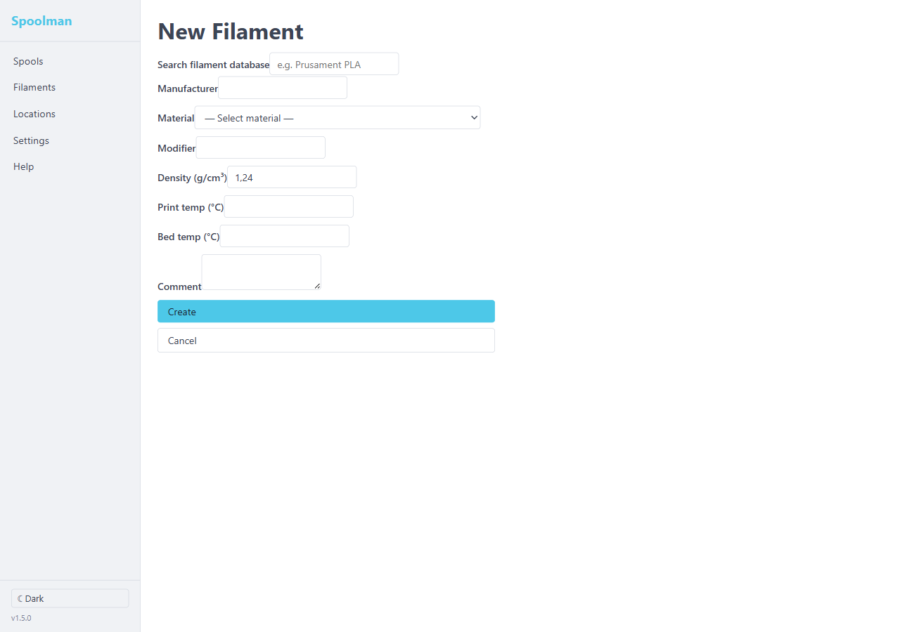
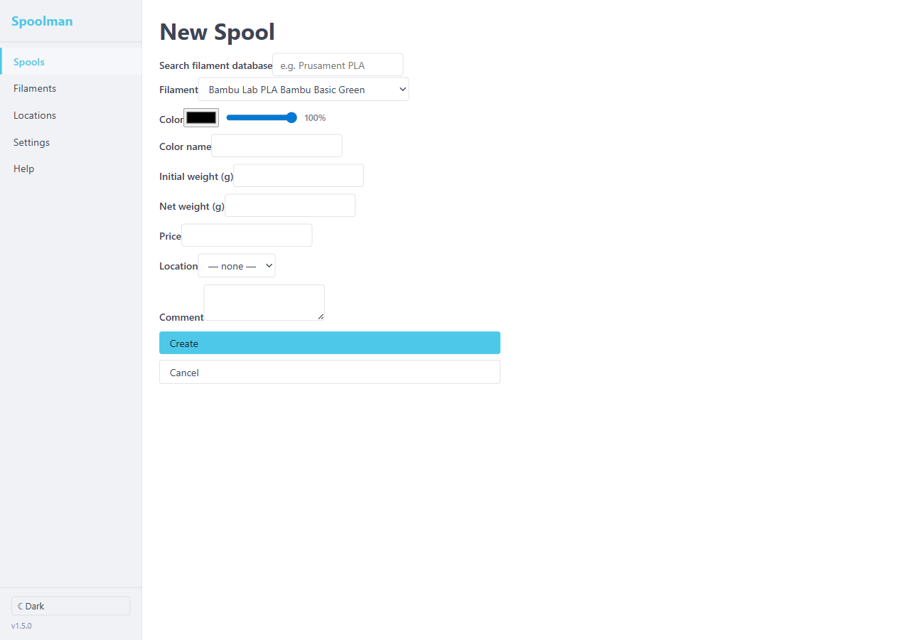
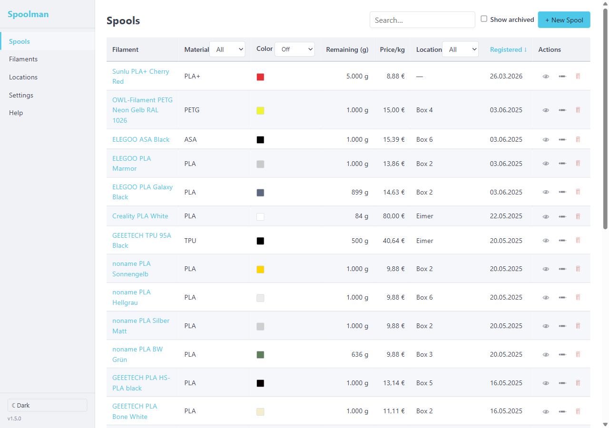

<picture>
    
</picture>

<br/>


# Spoolman light

_A lightweight filament tracker for home 3D printing._

Spoolman light is a self-hosted web service for tracking your 3D printer filament spools. It is a simplified fork of [Donkie/Spoolman](https://github.com/Donkie/Spoolman) designed for home use — one or two printers and a shelf of spools — with no database server, no vendor management, and no external integrations required.

## Features

* **Filament & Spool Tracking**: Keep records of filament types and individual spools, including RGBA color(s) on the spool.
* **Location Management**: Organise spools into named locations (shelves, dry boxes, etc.) with live spool counts.
* **Weight Tracking**: Record initial and current weight (scale readings); used weight and remaining percentage are derived automatically.
* **SpoolmanDB Search**: Filament lookup via the SpoolmanDB online database (`GET /api/v1/filament/search`).
* **Data Export**: Download the full data store as JSON via `GET /api/v1/export`.
* **REST API**: Clean REST API compatible with Spoolman-aware clients (Klipper plugins, OrcaSlicer, etc.).
* **Web Client**: Built-in browser UI with dark mode support.
* **Simple Storage**: All data stored in a single JSON file — no database server required.

## Installation

### Docker (recommended)

#### Quick start

Build the image and start a container with a persistent data volume:

```bash
docker build -t spoolman-light .
docker run -d \
  --name spoolman \
  --restart unless-stopped \
  -p 8000:8000 \
  -v spoolman_data:/data \
  spoolman-light
```

Or use the included `docker-compose.yml`:

```bash
docker compose up -d
```

The web UI is available at `http://localhost:8000`.

> **Building requires Linux/WSL/Docker** — `cargo leptos build` fails on native Windows because `openssl-sys` needs OpenSSL dev headers. Build inside WSL, a Linux machine, or via `docker build .` which handles everything in a multi-stage container.

#### Environment variables

All variables can be set in a `.env` file in the working directory — the server loads it silently on startup (a missing file is not an error).

| Variable | Default | Purpose |
|----------|---------|---------|
| `SPOOLMAN_DATA_FILE` | `<platform data dir>/spoolman.json` | Path to JSON data file |
| `SPOOLMAN_HOST` | `0.0.0.0` | Bind host |
| `SPOOLMAN_PORT` | `8000` | Bind port |
| `SPOOLMAN_CORS_ORIGIN` | `FALSE` | CORS allowed origin (`FALSE` = disabled) |
| `SPOOLMAN_BASE_PATH` | `""` | URL base path prefix (set if behind a reverse-proxy sub-path) |
| `SPOOLMAN_DEBUG_MODE` | `FALSE` | Enable debug mode |
| `SPOOLMAN_LOGGING_LEVEL` | `info` | Log level (`trace`/`debug`/`info`/`warn`/`error`) |
| `SPOOLMAN_AUTOMATIC_BACKUP` | `TRUE` | Enable daily backup rotation |

#### Synology NAS (Container Manager)

**Step 1 — build the image** on a Linux machine or in WSL:

```bash
docker build -t spoolman-light:latest .
```

**Step 2 — transfer the image** to the NAS. Either:

- Export/import via file:
  ```bash
  docker save spoolman-light:latest | gzip > spoolman-light.tar.gz
  scp spoolman-light.tar.gz admin@synology:/volume1/docker/
  ```
  Then in **Container Manager → Image → Add → Add from File**.

- Or push to a registry and pull from Synology:
  ```bash
  docker tag spoolman-light:latest yourname/spoolman-light:latest
  docker push yourname/spoolman-light:latest
  ```

**Step 3 — create a data directory** on the NAS and fix ownership (the container runs as uid 65532):

```bash
# SSH into Synology
mkdir -p /volume1/docker/spoolman-light/data
chown 65532 /volume1/docker/spoolman-light/data
```

**Step 4 — deploy via Container Manager → Project → Create**, using this compose file:

```yaml
services:
  spoolman:
    image: spoolman-light:latest
    restart: unless-stopped
    ports:
      - "8000:8000"
    volumes:
      - /volume1/docker/spoolman-light/data:/data
    environment:
      - SPOOLMAN_DATA_FILE=/data/spoolman.json
    security_opt:
      - no-new-privileges:true
```

**Step 5 (optional) — HTTPS via DSM reverse proxy**: in **Control Panel → Login Portal → Advanced → Reverse Proxy** add a rule pointing `https://spoolman.yourdomain` → `http://localhost:8000`.

Your data persists in `/volume1/docker/spoolman-light/data/spoolman.json` and is visible in File Station.

### Build from source

Requirements: Rust stable (see `rust-toolchain.toml`), `cargo-leptos`, `wasm32-unknown-unknown` target.

```bash
rustup target add wasm32-unknown-unknown
cargo install cargo-leptos --locked

cargo leptos build --release
./target/release/spoolman-server
```

## Using the web interface

### Filaments

A **Filament** is a material specification shared across one or more spools — the brand, material type, and print settings. Colours live on individual spools, not on the filament.



| Field | Required | Description |
|-------|----------|-------------|
| **Manufacturer** | No | Brand name, e.g. `Bambu Lab`, `Polymaker`, `eSUN` |
| **Material** | No | Material type selected from 42 standardised types (PLA, PETG, TPU, ABS, ASA, PC, …). See full list below. |
| **Modifier** | No | Additional descriptor beyond the base material, e.g. `Matte`, `Silk`, `CF` (carbon-fibre), `HF` (high-flow), `+` |
| **Diameter (mm)** | Yes | Filament diameter. Default `1.75`. Hidden when *uniform diameter* mode is enabled in Settings. |
| **Density (g/cm³)** | Yes | Used to derive remaining filament weight from current scale readings. Default `1.24` (PLA). Common values: PLA 1.24, PETG 1.27, ABS 1.05, TPU 1.20. |
| **Print temp (°C)** | No | Nominal nozzle temperature |
| **Bed temp (°C)** | No | Nominal bed temperature |
| **Comment** | No | Free-text notes |

**SpoolmanDB lookup** — the search bar at the top of the form queries the [SpoolmanDB](https://www.spoolman.se/filaments) online database. Selecting a result auto-fills all fields, saving manual entry.

<details>
<summary>All supported material types</summary>

| Abbreviation | Full name |
|---|---|
| PLA | Polylactic Acid |
| PETG | Polyethylene Terephthalate Glycol |
| TPU | Thermoplastic Polyurethane |
| ABS | Acrylonitrile Butadiene Styrene |
| ASA | Acrylonitrile Styrene Acrylate |
| PC | Polycarbonate |
| PCTG | Polycyclohexylenedimethylene Terephthalate Glycol |
| PP | Polypropylene |
| PA6 | Polyamide 6 |
| PA11 | Polyamide 11 |
| PA12 | Polyamide 12 |
| PA66 | Polyamide 66 |
| CPE | Copolyester |
| TPE | Thermoplastic Elastomer |
| HIPS | High Impact Polystyrene |
| PHA | Polyhydroxyalkanoate |
| PET | Polyethylene Terephthalate |
| PEI | Polyetherimide |
| PBT | Polybutylene Terephthalate |
| PVB | Polyvinyl Butyral |
| PVA | Polyvinyl Alcohol |
| PEKK | Polyetherketoneketone |
| PEEK | Polyether Ether Ketone |
| BVOH | Butenediol Vinyl Alcohol Copolymer |
| TPC | Thermoplastic Copolyester |
| PPS | Polyphenylene Sulfide |
| PPSU | Polyphenylsulfone |
| PVC | Polyvinyl Chloride |
| PEBA | Polyether Block Amide |
| PVDF | Polyvinylidene Fluoride |
| PPA | Polyphthalamide |
| PCL | Polycaprolactone |
| PES | Polyethersulfone |
| PMMA | Polymethyl Methacrylate |
| POM | Polyoxymethylene |
| PPE | Polyphenylene Ether |
| PS | Polystyrene |
| PSU | Polysulfone |
| TPI | Thermoplastic Polyimide |
| SBS | Styrene-Butadiene-Styrene |
| OBC | Olefin Block Copolymer |
| EVA | Ethylene Vinyl Acetate |

Any string not in this list is preserved as-is (round-trips without error).
</details>

---

### Spools

A **Spool** is a physical roll of filament. It references a Filament for material properties and adds colour, weight, location, and pricing.



| Field | Required | Description |
|-------|----------|-------------|
| **Filament** | Yes | Select from your saved filaments. When using SpoolmanDB lookup, a matching filament is found automatically — or created if none exists. |
| **Color** | No | RGB colour picker + opacity slider (0–100 %). The colour is stored as RGBA and shown as a swatch in the spool list. |
| **Color name** | No | Human-readable colour label, e.g. `Galaxy Black`, `Bambu Blue`. Auto-filled from SpoolmanDB. |
| **Initial weight (g)** | Yes | Full spool weight **including the empty spool** at the time of creation — a scale reading. Example: put the brand-new spool on the scale and enter the value. |
| **Net weight (g)** | No | Filament-only weight printed on the spool label (e.g. `1000 g`). Used together with initial weight to calculate remaining filament once spool weight is unknown. |
| **Price** | No | Purchase price. The currency symbol is set in **Settings**. |
| **Location** | No | Storage location — shelf, dry box, printer, etc. Managed under the Locations tab. |
| **Comment** | No | Free-text notes |

**Weight tracking** — after each print, open the spool and enter the new scale reading in **Current weight**. The UI derives:
- *Used weight* = initial weight − current weight
- *Remaining filament* = current weight − (initial weight − net weight), i.e. net weight minus used filament



---

### Locations

Locations are named storage spots (dry box, shelf A, printer enclosure, …). Each location shows a live count of spools stored there. Spools can be filtered by location in the spool list.

## Stack

| Layer | Technology |
|-------|-----------|
| Backend | Rust 1.82+, Axum, Tokio |
| Frontend | Rust, Leptos (WASM), compiled into the server binary |
| Storage | JSON file (`spoolman.json`) — no database |
| Types | `spoolman-types` crate shared by server and client |

The entire application ships as a **single self-contained binary** with no Python runtime, no Node.js, and no external database.

## Migrating from Spoolman

If you have data in the original [Donkie/Spoolman](https://github.com/Donkie/Spoolman), use the included converter script to produce a `spoolman.json` file that this service can load.

**Step 1 — export from the old Spoolman:**

```
GET /api/v1/export/spools?fmt=json    → save as spools_export.json
GET /api/v1/export/filaments?fmt=json → save as filaments_export.json  (optional)
```

**Step 2 — convert:**

```bash
python scripts/convert_export.py spools_export.json \
    --filaments filaments_export.json \
    --output spoolman.json
```

**Step 3 — start this service** pointing `SPOOLMAN_DATA_FILE` at the output file:

```bash
docker run -p 8000:8000 -v /path/to/data:/data \
  -e SPOOLMAN_DATA_FILE=/data/spoolman.json \
  spoolman-light
```

> `--filaments` is optional but recommended — it includes filaments that have no associated spools.

## API

| Method | Path | Description |
|--------|------|-------------|
| GET/POST | `/api/v1/filament` | List / create filaments |
| GET/PATCH/DELETE | `/api/v1/filament/:id` | Get / update / delete a filament |
| GET | `/api/v1/filament/search` | Search SpoolmanDB |
| GET/POST | `/api/v1/spool` | List / create spools |
| GET/PATCH/DELETE | `/api/v1/spool/:id` | Get / update / delete a spool |
| POST | `/api/v1/spool/:id/clone` | Clone a spool |
| GET/POST | `/api/v1/location` | List / create locations |
| GET/PATCH/DELETE | `/api/v1/location/:id` | Get / update / delete a location |
| GET | `/api/v1/material` | List distinct filament materials |
| GET | `/api/v1/export` | Full data store JSON download |
| GET | `/api/v1/setting` | List all settings |
| PUT | `/api/v1/setting/:key` | Set a key-value setting |
| GET | `/health` | Health check |
| GET | `/info` | Server version and data file path |

## What's removed vs upstream Spoolman

This fork deliberately omits features that add complexity without value for home use:

- No Vendor entity (vendor is a plain string on Filament)
- No extra-fields system
- No WebSocket live-updates (use polling)
- No Prometheus metrics
- No multi-database support (JSON file only)
- No QR / label printing page

## Related Projects
- https://github.com/yanshay/SpoolEase
- https://github.com/olmos-cmd/Filament-Tracker
- https://github.com/Tellus75/spool_manager_U1/blob/main/README.en.md
- https://github.com/XMan0085/Filament-Manager
- https://github.com/LatinoF/LTFSpoolManager
- https://github.com/Fire-Devils/filaman-system
